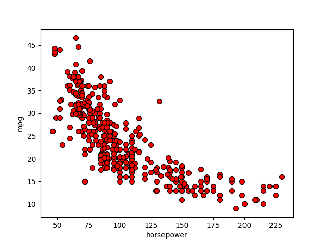
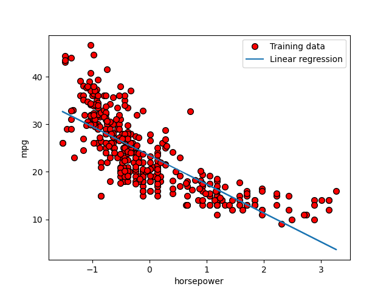
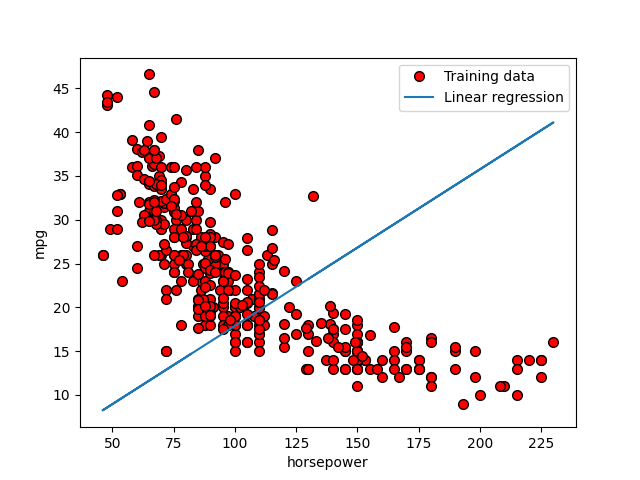

# LINEAR REGRESSION

### To Run This Program
* Make sure all imports library's are installed. Then just in command line run `python3 main.py`

## Goal of This Homework; Implement Linear Regression From Scratch and see it Work on Data.
* I worked through this homework by first implementing **linear regression** and plot the data
    * 
* Then we normalize the data and print our mean and standard deviation
    ``` 
    Computed mean: 104.469387755 
    Computed standard deviation: 38.4420327144
    ```
* Next we use gradient descent, the cost is printed to show if our calculation is correct
    ```
    With theta = [0, 0] 
    Cost computed = 305.24
    Expected cost value (approximately) 305.24

    With theta = [30, -0.1]
    Cost computed = 51.26
    Expected cost value (approximately) 51.26
    ```
* I then plot the graph from before but with linear regression implemented.
    * 

* CHECKPOINT 4. predict the MPG for horse power of 50 and 200
    ```
        For horsepower = 50, we predict a MPG of 32.04

        For horsepower = 200, we predict a MPG of 8.37
    ```
* Next implement Linear Regression (multiple variables)
    * Predict car MPG based on HORSEPOWER and WEIGHT
    * We have to implement normalize, compute cost, and gradient descent again but this time for multiple variables.
* Our output looks like this:
    ```
    Predicted MPG of Horsepower = 100 and Weight = 2500 is 26
    Predicted MPG of Horsepower = 200 and Weight = 4500 is 10
    ```
* Gradient descent without normalization 
    ```
    With theta = [0, 0] 
    Cost computed = 305.24
    Expected cost value (approximately) 305.24

    With theta = [30, -0.1]
    Cost computed = 22.02
    Expected cost value (approximately) 51.26
    Theta found by gradient descent: 0.0110, 0.1788
    Expected theta values (approximately): [23.4459, -6.0679]
    ```
    