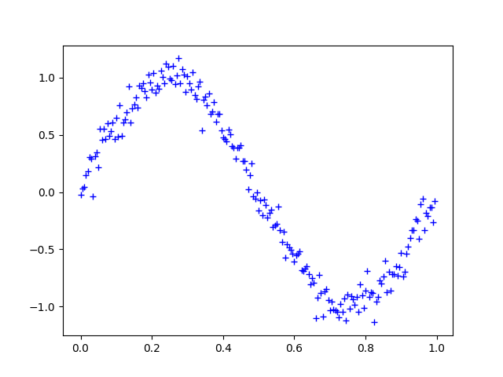

# Polynomial Regression, Normal Equation, Overfitting

## Goal of This Project
* In this homework you will answer questions to help you fully understand linear regression (Sec 2). You will also implement polynomial regression from scratch (Sec 3), compare the solution between gradient descent and normal equation, and get an idea of model complexity and overfitting.

## Polynomial Regression
* We create the data by sampling the sinusoidal function $f(x)=sin(2\pi x), x \in [0,1]$. Write the code to generate a dataset consisting of $m=200$ by evaluating the function $f(x)$ at $m$ uniformly sapced points in $x$ and adding I.I.D. white Gaussian noise with deviation $\sigma=0.1$. For instance: $$x_i = \frac{i}{m}, i=0,1,2,\cdots,m-1, y_i = f(x_i)+\epsilon_i, \epsilon_i \sim \mathcal{N}(0, \sigma^2)$$

Once we generate the dataset, we can plot it out. You should get a similar figure like this: 


## Normal Equation 

We have learned that the closed-form solution to linear regression is

$$ \theta = \left( X^T X\right)^{-1} X^T\vec{y}$$

Using this formula does not require any feature scaling, and you will get an exact solution in one calculation: there is no “loop until convergence” like in gradient descent.

```
# Here is an example 
# convert X to a column matrix of 5 x 1
# generate polynomial [1 X X^2 X^3]
# Use this hint to implement normal_equation()
X_col = X_data[:5].reshape(5,1)
X_poly = np.power(X_col, np.arange(4))
print(X_col)
print(X_poly)
```
```
[[ 0.   ]
 [ 0.005]
 [ 0.01 ]
 [ 0.015]
 [ 0.02 ]]
[[  1.00000000e+00   0.00000000e+00   0.00000000e+00   0.00000000e+00]
 [  1.00000000e+00   5.00000000e-03   2.50000000e-05   1.25000000e-07]
 [  1.00000000e+00   1.00000000e-02   1.00000000e-04   1.00000000e-06]
 [  1.00000000e+00   1.50000000e-02   2.25000000e-04   3.37500000e-06]
 [  1.00000000e+00   2.00000000e-02   4.00000000e-04   8.00000000e-06]]
 ```

 ## Polynomial Fitting

 Now repeat the polynomial fitting experiment by selecting a random subset of the dataset to train the model. The training set size is selected as: $m=\{10, 50, 100, 200\}$. The order of polynomials is selected as: $n=\{0,1,2,3,9\}$. So totally you will train $4\times5=20$ models.

```

The order of polynomial: 0
Theta:
[ 0.31831476]
MSE: 0.30286105
Theata2: 
[ 0.31831476]
The order of polynomial: 1
Theta:
[ 0.49319244 -1.56942852]
MSE: 0.10060343
Theata2: 
[-1.56942852  0.49319244]
The order of polynomial: 2
Theta:
[ 0.32363673  3.39264676 -5.94509707]
MSE: 0.05526217
Theata2: 
[-5.94509707  3.39264676  0.32363673]
The order of polynomial: 3
Theta:
[ -0.28601649  12.66219046 -35.98202805  23.57887439]
MSE: 0.01081872
Theata2: 
[ 23.57887439 -35.98202805  12.66219046  -0.28601649]
The order of polynomial: 9
...
Theata2: 
[  1.65418760e+03  -7.03913242e+03   1.23956638e+04  -1.16263088e+04
   6.14374742e+03  -1.69818415e+03   1.64061023e+02   1.29834778e+00
   4.69237269e+00   4.58802724e-02]
   ```

The graphs can be viewed in [polynomial_regression](figure/polynomial_regression/). The format will be `polynomial_curve_m_n.png` **m** is the amount of data and **n** is the polynomial.

## Regularization

Implement the regularization and perform ablation study to better understand underfitting, overfitting, and regularization.

### Create Testing Dataset

Create a testing dataset contains 199 uniformly spaced data points: $$x_{i,test} = x_{i,train} + \frac{1}{2 \times (m-1)}, i = 1, \cdots, m-1, y_{i,test} = f(x_{i,test})$$

### Polynomial Fitting

The training set size is selected as: $m=\{10, 50\}$. The order of polynomials is selected as: $n=\{3, 9\}$. Try different values of $lambda$ for each model, such as $ln\lambda = {-\infty, -18, 0}$, and pick out the best value.

For each model, report estimated model parameters, calculate the MSEs on training and testing data respectively, and plot the regression model together with the training and testing data. Use different color to distinguish training and testing data.

**OUTPUT:**

```
The order of polynomial: 3
Theta for training:
[ -0.14145154  12.04332517 -35.51534062  24.00039159]
Theta for testing:
[[ -0.22512535]
 [ 12.55804545]
 [-36.18960101]
 [ 23.95508424]]
MSE for training: 0.00699731
MSE for testing: 0.00406204
The order of polynomial: 9
Theta for training:
[ -1.19350361e+00   5.13205323e+01  -4.03530893e+02   1.33583444e+03
  -1.40933377e+03  -1.91827363e+03   4.29442871e+03   1.20277662e+03
  -6.55275797e+03   3.41724571e+03]
Theta for testing:
[[   19.98185688]
 [ -332.69976872]
 [ 2193.97168923]
 [-6775.0713758 ]
 [ 9080.54460226]
 [ -837.39231846]
 [-8235.51399188]
 [  748.33803921]
 [ 9398.26213077]
...
 [  1.94006225e+04]
 [ -4.40762209e+03]]
MSE for training: 0.00544534
MSE for testing: 0.00991670
```

The graphs can be viewed at [199_curve](figure/199_curve/). The format will be `curve_m_n.png` **m** is the amount of data and **n** is the polynomial.

## Conclusion

When using lambda you want to use a smaller number as much as possible with this example as it will eliminate most of the overfitting that is within the prediction while too large of a number gives a lot of overfitting.

