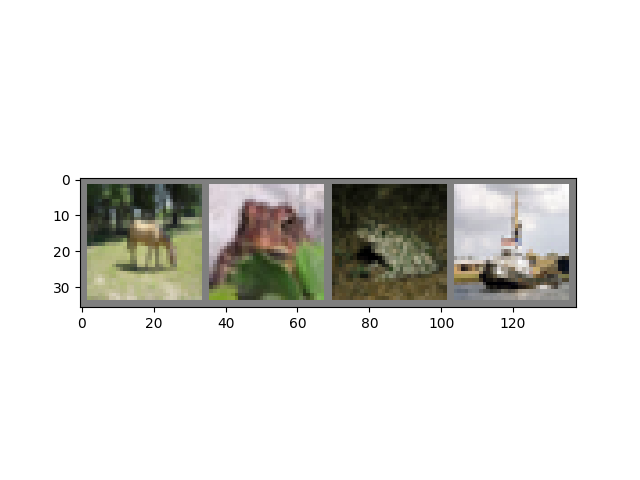
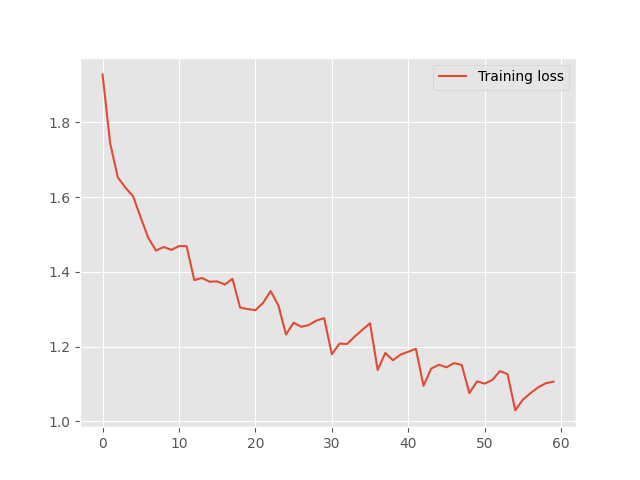
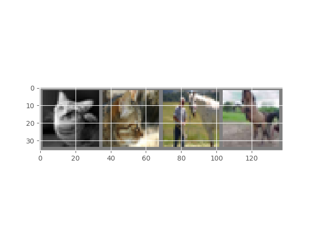
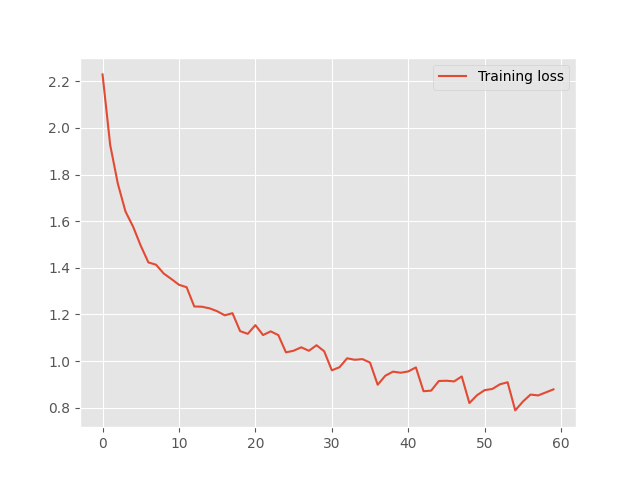

# Deep Learning Basic

## Goal of This Project

I will use Pytorch to implement Fully-Connected Feedforward Network and Convolutional Neural Network for image classification.

## Fully-Connected Feedforward Network for Image Classfication

In this section, I will use Pytorch to implement a Fully-Connected Feedforward Network for image classfication on CIFAR10.
Please read the Pytorch tutorial (https://pytorch.org/tutorials/beginner/basics/intro.html) to understand basic operations of Tensors, Dataloader, Automatic Differentiation and Model Optimization.

### Dataloader

CIFAR10 dataset has 10 classes: ‘airplane’, ‘automobile’, ‘bird’, ‘cat’, ‘deer’, ‘dog’, ‘frog’, ‘horse’, ‘ship’, ‘truck’. The images in CIFAR-10 are of size 3x32x32, i.e. 3-channel color images of 32x32 pixels in size. 

I will load and normalize the CIFAR10 training and test datasets using torchvision. The output of torchvision datasets are PILImage images of range [0, 1]. We transform them to Tensors of normalized range [-1, 1].

**What will be outputed:**



### Define a Fully-Connected Feedforward Network

I will implement a 3-layer Fully-Connected Feedforward Network. The network architecture: 2 hidden layers (128, 64 units respectively) and 1 output layer. We will use relu as the activation function except for the output layer. 

```
class Net(nn.Module):
    def __init__(self):
        super().__init__()
        
        ### START CODE HERE ###
        self.flatten = nn.Flatten()
        self.fc1 = nn.Linear(32 * 32 * 3,128 ) # first hidden layer
        self.relu = nn.ReLU()
        self.fc2 = nn.Linear( 128,64 ) #second hidden layer
        self.relu = nn.ReLU()
        self.fc3 = nn.Linear(64 , 10) 
        self.relu = nn.ReLU()
        ### END CODE HERE ###

    def forward(self, x):
        x = self.flatten(x)
        x = F.relu(self.fc1(x))
        x = F.relu(self.fc2(x))
        x = self.fc3(x)
        return x
```
### Define a Loss function and optimizer

Let’s use a Classification Cross-Entropy loss and SGD with momentum.

```
criterion = nn.CrossEntropyLoss()
optimizer = optim.SGD(net.parameters(), lr=0.001, momentum=0.9)
```

### Train our Data

We will loop over our data iterator, and feed the inputs to the network and optimize. 

We will end up with graph that graphs **training loss**



### Test the Network on the Test Data

On 10000 test images are accuracy is:

```
Accuracy of the network on the 10000 test images: 52 %
```

## Convolutional Neural Network for Image Classification 

Implement a Convolutional Neural Network (LeNet) based on what you have implemented before. 
- Network architecture: 
  Convolutional layer with 6 filters while each filter's resolution is 5 by 5  → relu → Max Pooling with size of 2 → Convolutional layer with 16 filters while each filter's resolution is 5 by 5 → relu → Max Pooling with size of 2 → Fully-Connected layer with size of 120 → relu → Fully-Connected layer with size of 84 → relu → Fully-Connected layer with size of 10.
- Repeat the training/testing process similar to Section 3, plot the training loss curve and report the      classification accuracy on the test data. 

As before we will load the data and will have something like this for our images:



### Define a Convolutional Neural Network for Image Classification

```
class Net_CNN(nn.Module):
    def __init__(self):
        super().__init__()
        
        ### START CODE HERE ###
        self.conv1 = nn.Conv2d(3,6 ,5 )
        self.pool = nn.MaxPool2d(2, 2)
        self.conv2 = nn.Conv2d( 6,16 ,5 )
        self.fc1 = nn.Linear(16 * 5 * 5,120 )
        self.fc2 = nn.Linear(120 ,84 )
        self.fc3 = nn.Linear( 84, 10)
        ### END CODE HERE ###

    def forward(self, x):
        x = self.pool(F.relu(self.conv1(x)))
        x = self.pool(F.relu(self.conv2(x)))
        x = torch.flatten(x, 1) # flatten all dimensions except batch
        x = F.relu(self.fc1(x))
        x = F.relu(self.fc2(x))
        x = self.fc3(x)
        return x
```
### Define a Loss Function and Optimizer

```
criterion = nn.CrossEntropyLoss()
optimizer = optim.SGD(net_CNN.parameters(), lr=0.001, momentum=0.9)
```

### Train our Data

As before a training loss graph will be shown:



### Test the Accuracy on the Test Data

```
Accuracy of the network on the 10000 test images: 61 %
```